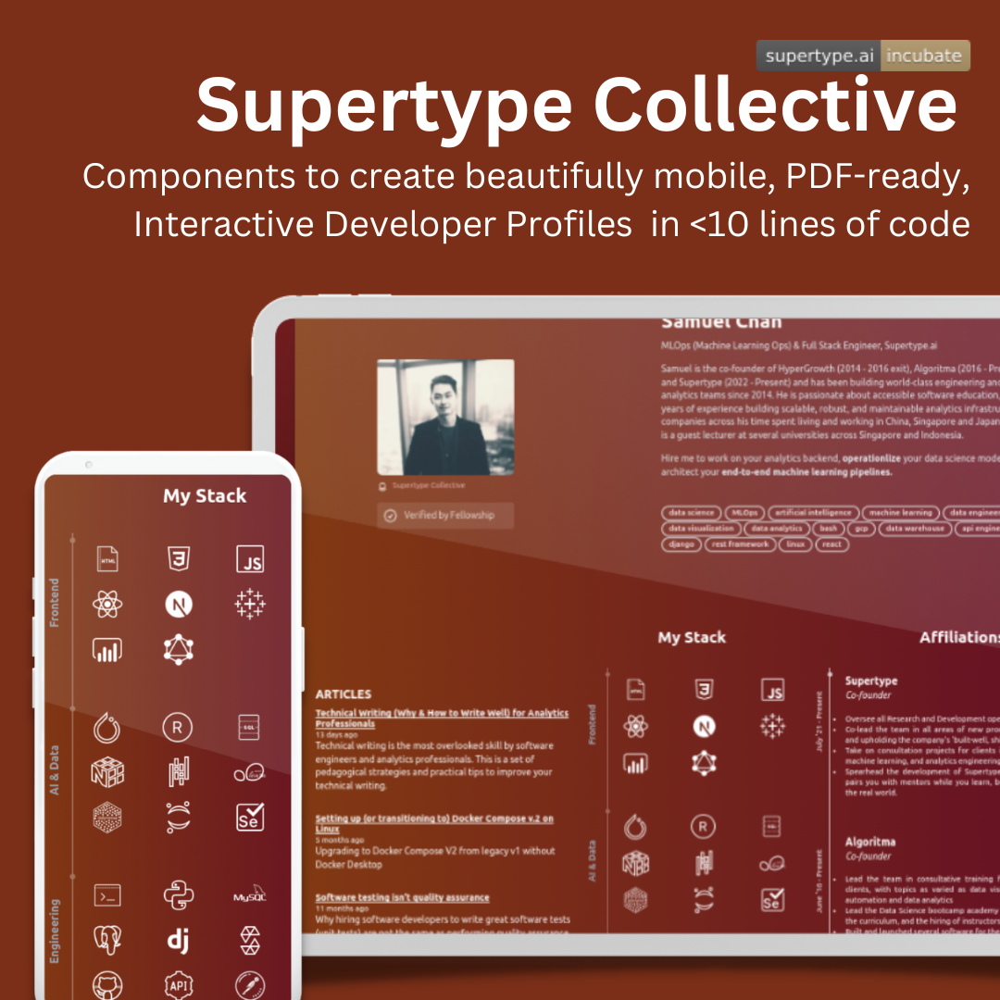
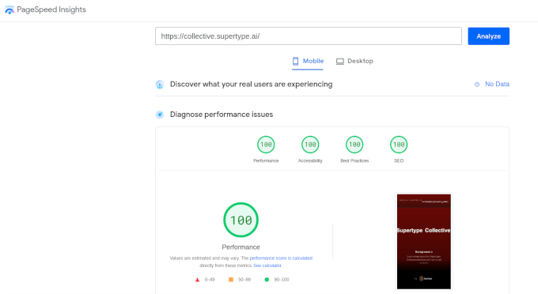

[](https://app.netlify.com/sites/thecollective/deploys) &nbsp; &nbsp; [](https://supertype.ai/incubate)

# Supertype Collective 
<!--  -->


[Supertype Collective](https://collective.supertype.ai) is a community of analytics developers, data scientists and engineering leaders building products across the full stack. It a highly curated place, with close collaboration between members looking to join forces on building high-impact analytics products. 

### Joining the Collective
We welcome members from all backgrounds, anywhere in the world, who wish to contribute to the Collective's vision of building an inclusive, collaborative, and healthy community of full stack analytics developers. 

Go to [collective.supertype.ai](https://collective.supertype.ai) to sign up for a free account and create your Developer Profile in less than 5 minutes.

### Help Supertype Community grow 
- ⭐ Star this repo to show your support! 
- 📣 Share this repo with your full-stack developer friends!
- 📝 Contribute to the Wiki page to help others get started
- 📧 [Email us](mailto:s@supertype.ai) with questions or feedback if you have other means of helping us grow the Collective

## Getting Started (for Collective members)

Once a profile has been created, it will be accessible at `https://collective.supertype.ai/p/<your-name>`. Supertype Collective is tested on the latest version of Chrome, Firefox and Brave browsers.

Out of the box, your Developer Profile will:
- 📱 Looks great on every device, from mobile to the largest piece of desktop hardware you can find
- 📊 Show the tech stack you use, affiliations, and other relevant information collected from GitHub or from the `data/profiles/<your-name>.json` file
- ⚡ Blazing fast, with a 100 score on Performance, Accessibility, Best Practices and SEO on Google Lighthouse (now Google PageSpeed Insights) for both mobile and desktop
- 🔗 API-driven, connect to your GitHub and WordPress accounts to automatically populate your profile with relevant information (more integrations to be supported soon)
- 📄 Export Developer Profile to PDF directly 
- 📦 Stacks-based approach to showcase your tech stack, with support for:
    - More than 200 techs and tools to choose from, including the most popular programming languages, frameworks, databases and tools in the data science and software engineering domains
    - A beautiful layout system that works great on mobile and desktop
- 💻 More than 200 icons to choose from, including the most popular programming languages, frameworks, databases and tools in the data science and software engineering domains
- 🥇 More than 20+ badges automatically generated from your GitHub profile to make it fun and rewarding to contribute to open source projects
- More to come!


<!--  -->


Perfect score on Performance, Accessibility, Best Practices and SEO on Google Lighthouse (now Google PageSpeed Insights) for both mobile and desktop

## Contributing
Read [the Wiki page](https://github.com/supertypeai/collective/wiki) for more details on:
- [Improving Collective platform as a code contributor](https://github.com/supertypeai/collective/wiki/Development-(for-Maintainers))

### Building Blocks 
At its core, Supertype Collective comes with a set of React components that can be used to build your profile. We call them "blocks". They are built with Tailwind CSS and are available in the `blocks` directory.

Below is a semi-complete example. You can see the output of these blocks on Supertype's co-founder [Samuel Chan](https://collective.supertype.ai/p/samuel)'s Developer Profile using these pre-made blocks:

```js
import me from '@/data/profiles/<your-name>.json'

export async function getStaticProps() {
    ...
    return {
        props: {
            data: me
        },
    }
}

const MyStack = () => {
    return (
        <Stack>
            <StackSection sectionName="AI &#38; Data">
                <IconRow tags={['pytorch', 'r', 'sql']} />
                <IconRow tags={['numpy', 'pandas', 'sklearn']} />
            </StackSection>
            ...
        </Stack>
    )
}

const Profile = ({ data }) => {    
    return (
        <Mainframe data={data}>
            <Toprow />
            <Body stack={<MyStack />} affiliations={<Affiliations />} />
        </Mainframe>
    )
}
```

Once you're done editing your Developer Profile (`data/profiles/<your-name>.json` and `pages/p/<your-name>.json)`, run `yarn build` to generate a production build and confirm that there are no warnings. You can now push it to GitHub and open a pull request to merge your changes into the `main` branch, where it will be deployed onto the Collective platform, waiting for you to share with the world!

## About Supertype Incubator
Supertype Incubator is the in-house product factory of [Supertype](https://supertype.ai/incubate), a full cycle data science consultancy. It is the birthplace for several of Supertype products, including Supertype Collective, and is a place where our members can experiment on new ideas with total freedom, world class engineering support, absolute creativity and autonomy.