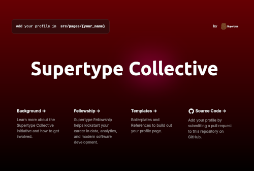

[](https://app.netlify.com/sites/thecollective/deploys) &nbsp; &nbsp; [](https://supertype.ai/incubate)

# Supertype Collective 
<!--  -->


[Supertype Collective](https://collective.supertype.ai) is a community of analytics developers, data scientists and engineering leaders building products across the full stack. It a highly curated place, with close collaboration between members looking to join forces on building high-impact analytics products. 

### Joining the Collective
We welcome members from all backgrounds, anywhere in the world, who wish to contribute to the Collective's vision of building an inclusive, collaborative, and healthy community of full stack analytics developers. 

Read [the Wiki page](https://github.com/supertypeai/collective/wiki) for more details on joining the Collective.

## Getting Started (for Collective members)
Supertype Collective is built with Next.js and Tailwind CSS. You should be able to get started by cloning the repo and running `yarn install` (preferred) or `npm install`. This installs all the dependencies and you should be able to run the development server with `yarn dev` (preferred) or `npm run dev`. Proceed to the [Wiki page](https://github.com/supertypeai/collective/wiki) for instructions on creating your Developer Profile.

Once a profile has been created, it will be accessible at `https://collective.supertype.ai/p/<your-name>`.

### Building Blocks 
Supertype Collective comes with a set of React components that can be used to build your profile. We call them "blocks". They are built with Tailwind CSS and are available in the `blocks` directory.

Below is a complete example. You can see the output of these blocks on Supertype's co-founder [Samuel Chan](https://collective.supertype.ai/p/samuel)'s Developer Profile using these pre-made blocks:

```js
import me from '@/data/profiles/<your-name>.json'

export async function getStaticProps() {
    ...
    return {
        props: {
            data: me
        },
    }
}

const MyStack = () => {
    return (
        <Stack>
            <StackSection sectionName="AI &#38; Data">
                <IconRow tags={['pytorch', 'r', 'sql']} />
                <IconRow tags={['numpy', 'pandas', 'sklearn']} />
                <IconRow tags={['tidyverse', 'jupyter', 'selenium']} />
            </StackSection>
            ...
        </Stack>
    )
}

const Profile = ({ data }) => {    
    return (
        <Mainframe data={data}>
            <Toprow />
            <Body stack={<MyStack />} affiliations={<Affiliations />} />
        </Mainframe>
    )
}
```

You should never need to directly edit anything in the `blocks` directory, and focus on using these recycable components to build your profile. In practice, this means most of your whole changes are to the `<MyStack />` component and to the `data/profiles/<your-name>.json` file. This makes your Pull Request (PR) more focused, which ease the review process. 

All pull requests starting with a branch name `profile-<your-name>` will be assumed to only contain changes to:
- `data/profiles/<your-name>.json`
- `pages/p/<your-name>.js`

## About Supertype Incubator
Supertype Incubator is the in-house product factory of [Supertype](https://supertype.ai/incubate), a full cycle data science consultancy. It is the birthplace for several of Supertype products, including Supertype Collective, and is a place where our members can experiment on new ideas with total freedom, world class engineering support, absolute creativity and autonomy.